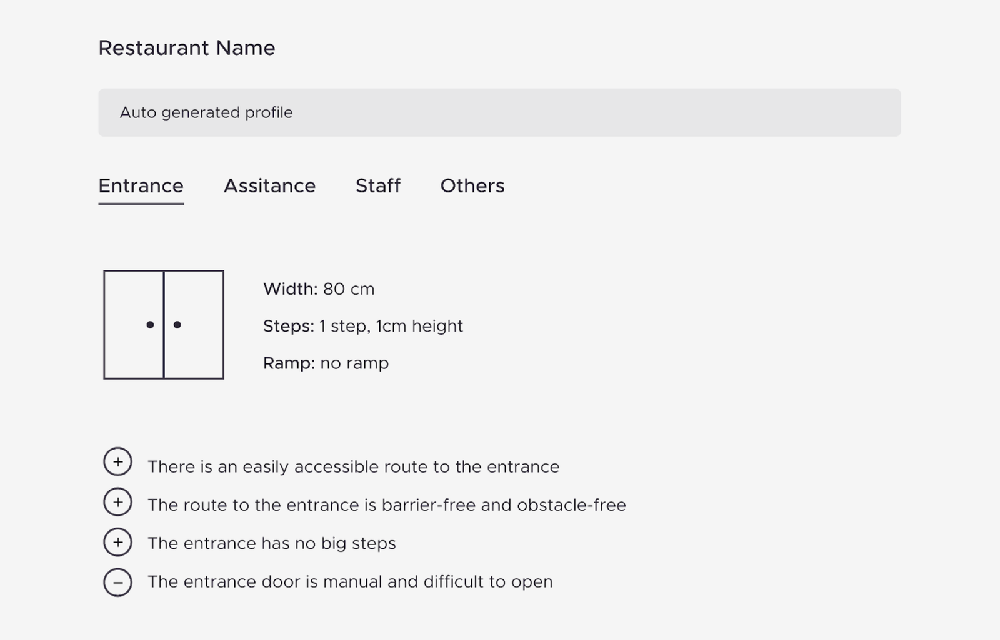
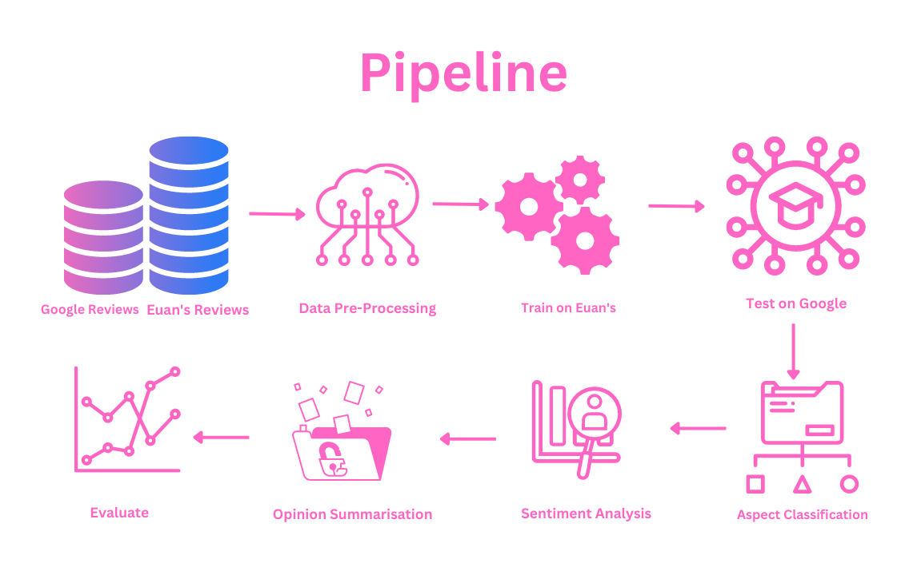

# Venue Accessibility with Google Reviews 

This project aims to highlight the perspective of people with Reduced Mobility (RM) living in Amsterdam via analysis of public venue reviews. This is done using Natural Language Processing (NLP) techniques such as Aspect Based Sentiment Analysis and Opinion Summarisation. 

It is an extension of the work carried out by [L. Da Rocha Bazilio](https://github.com/Amsterdam-Internships/Venue-Accessibility-NLP), to understand how different models are able to extract aspects in reference to accessibility with data that is noisy e.g. a mixture of topics, instead of accessibility focused only.

In addition, understanding the impact of Opinion Summarisation on the reviews about accessibility. Also, how this can make activity and journey planning for those with RM easier. 


This is an example of the UI of the application that pipeline will be connected to:



---


## Project Folder Structure

There are the following folders in the structure:

1) [`data`](./data): This folder includes data for the following purposes:
    1) [`external`](./data/external/): This includes data from third party sources.
    1) [`interim`](./data/interim/): Intermediate data that has been transformed.
    1) [`processed`](./data/processed/): Finalised datasets for modelling.
    1) [`raw`](./data/raw/): The original immutable data.
1) [`datasets`](./datasets): This is where you should place your data for training and testing.
1) [`media`](./media): This is where results of each step of the pipeline are stored as images.
1) [`models`](./models/):Trained and serialized models, model predictions, or model summaries
1) [`notebooks`](./notebooks): This contains the notebooks of the pipeline.
1) [`reports`](./reports/): Generated analysis as HTML, PDF, LaTeX, etc.
    1) [`figures`](./reports/figures/): Generated graphics and figures to be used in reporting.
1) [`results`](./results): Here you will find the txt form of the results.
1) [`src`](./src): Folder for all source files specific to this project
1) [`scripts`](./scripts): Folder with example scripts for performing different tasks (could serve as usage documentation)
1) [`tests`](./tests) Here I store all of the tests for project
---


## Installation


1) Clone this repository:
    ```bash
    git clone git@github.com:Amsterdam-Internships/Venue-Accessibility-Google-Reviews.git
    ```

2) Install all dependencies:
    ```bash
    conda install environment.yml or pip install requirements.txt
    ```
---

## Setup
In order to setup the pipeline you need to download the google test data from [here](https://drive.google.com/file/d/1WrLIbSGdlAWDTXPwJo35xIgzQlaa0ujz/view?usp=sharing) and the euan's guide data [here](https://docs.google.com/spreadsheets/d/1G1mwijJqQ5LTivIA3fMOZm_3SEJ1Jg_v/edit?usp=share_link&ouid=106259336767035025054&rtpof=true&sd=true)

To setup the environment please create your own .env file with a variable called $LOCAL_ENV this is where you should keep the file path of your home directory. Then you will be able to connect this to the relative paths of this repo. 

E.g.  $LOCAL_ENV = /Users/yourname/Venue-Accessibility-Google-Reviews

To run this pipeline run the bash script titled ['full_pipeline.sh'](./scripts/full_pipeline.sh)


## How it works

The image below displays the workflow of the pipeline, these steps correspond to the folder structure of the pipeline.



---
## Acknowledgements


This repository was created in collaboration with [Amsterdam Intelligence](https://amsterdamintelligence.com/) for the [City of Amsterdam](https://www.amsterdam.nl/). It is based on [the prior work](https://github.com/Amsterdam-Internships/Venue-Accessibility-NLP) of [Lizzy Da Rocha Bazilio](https://www.linkedin.com/in/lizzy-da-rocha-bazilio/).
